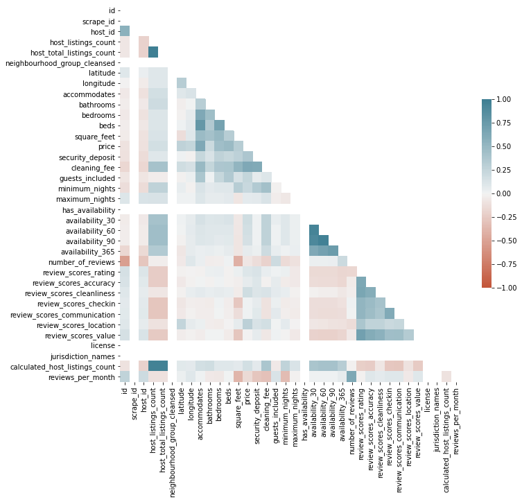

# The meaning of Scores

Hello, everyone I hope you are all safe and healthy. Today I wanna talk about my project detail, challenges, and solutions, I hope you can enjoy and sympathize with my struggles.

 My task here was to create at least 3 business or real-world question about a data set, I could decide between 3 different data sets: Stack Overflow Data - 2017 Survey, Seattle AirBNB Data, Boston AirBNB Data. I randomly chose Boston AirBNB to work with.
To picture my current status in the Data Science field, I started this course at the end of November and this is my first project at Udacity, I’ve just finished a Data Analytics course
at Redi school, here in Berlin, and because I still motivated to study I’ve decided to enroll in this journey. 

The first part of my code is about importing libraries and exploring the data, the tricky part is that the first touch with data happens only one time, and on the libraries importation part we can update all time as we need.

Understanding your data set is crucial and for me is always an overwhelmed moment, when you have all information but everything seems to be disconnect. I create a list that helps me break the ice with the data.

- Name the data sets with a significant name. 
- Draw a connection between data sets. One to many or many to one could be a good and easy start.
- Use describe( ), info( ), and head( ) functions.

I’ve used those functions to understand the data set and check if the data types were correct, and guess what? Were not! 

Meanwhile, I was thinking about the relevant business questions, and a came up with 2 big questions:

1. We would like to send an advertisement in a moment that our clients are more likely to rent, close the deal. 

2. For us to think about expanding in the Boston area, we need to understand which characteristics our clients prefer in an apartment 

These questions are very complex and can be highly detailed, everything depends on how reliable you want your results and how much time and experience do you have working with these analyses. 

Back to the data set, I realize that I didn’t have enough information to answer the first question… And that happens =(

I list the columns of all my data sets and to dive deeper into the second question, I modify some data types such as "cleaning_fee", "security_deposit", "price" changing from object to float. 
For small analyses, I choose to work with correlations regarding the ''Scores''.
From my understanding as a client, we give a score as feedback from what we like and what we claim as an improvement. 

I did some plots to better understand the correlation between the scores, I was trying to see if, for example, if I have the rating score lower I also will have the cleanliness score lower. My first attempt was to use the **seaborn pair plot**, but the visualization wasn’t so clear to understand the correlation. To better understand the behavior of the scores I used a ***seaborn heat map**, and changed the correlation mode to **Spearman's** correlation, that way we can see if the features are increasing or decreasing together. And then I could answer some questions. 

1. Does location score affect the value score, been in a good spot normally is expensive, and want to the impact on the overall score?

    _R: Reading the heat-map we can identify that location score does not affect any other score, and this is a big surprise. Could be because clients already know the location before renting or most of the places are located downtown._

2. Expensive apartment get better classification scores, in general?
    
    _R: Seems that price does not have a strong correlation with the scores. Perhaps because customers tend to pay way before their trip._

3. Which scores are impacted more in other scores, can we see the reflection of one score in others?

    _R: Yes we can see, score value seems to increase together with score rating, accuracy, and cleanliness._

**Curiosity!**
There is a negative correlation between number_of_reviews and square_feet, which means that when one increases, the other decreases. Therefore, the more square meters, the smaller the number of evaluations, or else we will have, for the most part, small apartments.

Thank you guys for reading this blog, I hope you can find something interesting and if you want to check more about the code, take a look at my Github page =)
